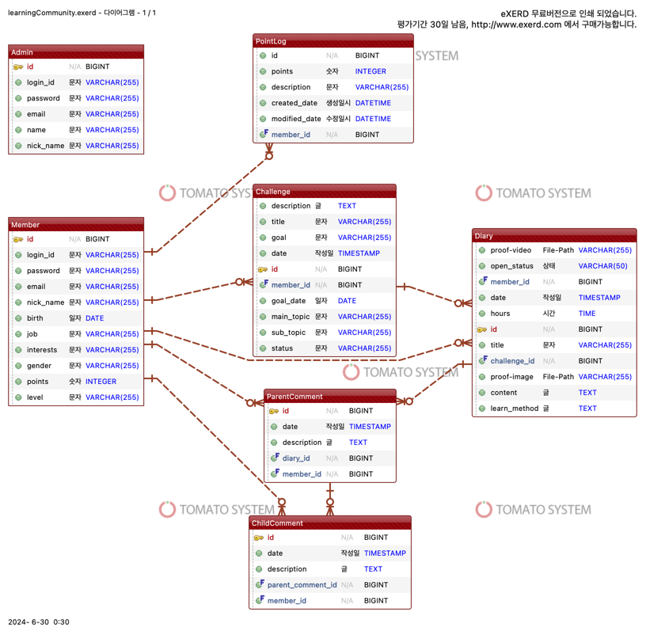

# 학습 커뮤니티 서비스 만들기
한 분야에 대해 목표를 정하고 기간을 정해 일지를 작성하며 챌린지 계획, 수행, 결과 내용을 회원들과 공유하는 커뮤니티 서비스 입니다.

## 회원 관리
--- 
### 일반 회원
[회원 가입 / 로그인]
- 사용자 편의성을 위해 외부 소셜 아이디로 가입 가능하게 구현 [ v ]
- OAuth2 & Spring Security 사용 [ v ] 
- 입력 정보: 이름, 이메일, 생년월일, 전화번호, 아이디, 닉네임, 비밀번호, 직업, 성별, 관심분야 [ v ]
* 입력 제한
  - 로그인 아이디: 15자, 영문+숫자 허용
  - 비밀번호: 영문+숫자+특수문자 포함, 8~20자
  - 이메일: 이메일 형식 (email@examp.com)
  - 전화번호: 숫자만 포함, 10~15자
  - 닉네임: 2~12자
  - 이름: 2~12자
- 로그아웃 기능 [ v ] 
- 권한 부여: 기본권한(USER) [ v ] 
* 데이터 저장
  - 비밀번호 : BCrypt 비밀번호 해싱 [ v ] 
  - 전화번호 : AES [ v ]
  - 
[회원 정보 조회 / 수정 / 탈퇴]
- 권한 : 자기 자신 & 관리자
- 자신의 회원 정보를 조회할 수 있게 함(타 회원 정보 조회 불가) [ v ] 
- 회원 정보 수정 가능: 이름, 이메일, 생년월일, 닉네임, 직업, 관심분야 [ v ] 
- 조회 내용: 이름, 이메일, 생년월일, 아이디, 닉네임, 직업, 성별, 관심분야, 현재 포인트 [ v ] 
* 추가기능 : 비밀번호 변경 [  ] 

<< 엔드포인트 >>
  - POST /users/register
  - POST /users/login
  - GET /users/me
  - PUT /users/me
  - DELETE /users/me
  - POST /logout

### 관리자 [  ]
[회원 조회]
- 전체 회원 조회
- 개별 회원 조회

[회원정보 수정]
- 비밀번호 초기화
- 권한 수정

[포인트 지급]
- 학습내용 인증 시 포인트 자동지급(+10point)
- 일정 포인트 도달하면 러너 배지 부여(ex. 500point -> bronze / 1000point -> silver)
- 학습 완료 및 목표 달성 인증 시 추가 포인트 지급(+5000point)
*단, 추가 포인트는 관리자가 인증 내용을 검토완료한 후에 지급
*배지(level)
  1)bronze(500point)
  2)silver(1000point)
  3)gold((2500point)
  4)master(6000point)

[포인트 회수]
- 모니터링을 통해 학습인증이 부실하거나 잘못됐을 경우 회수
- 신고내용 참고

<< 엔드포인트 >>
  - GET /admin/users
  - GET /admin/users/{id}
  - PUT /admin/users/{id}/reset-password
  - PUT /admin/users/{id}/change-role
  - PUT /admin/users/{id}/points

## 일지 작성
---
### 일반 회원 
[챌린지 등록] [ v ]
- 분야 설정: 언어, 학위, 시험, IT, 음악, 미술, 스포츠, 문학, 사진, 영상, 기타 * 필수
- 목표(ex. 공모전 수상): 100자 이내 * 필수
- 시작 날짜: 현재 이후 날짜로 선택 가능 * 필수
- 목표 날짜: 최소 4주 이상 * 필수
- 기타 설명(동기, 다짐, 계획 등): 0 ~ 1000자
- 제한 : 설정한 기한 내에 이미 등록된 챌린지가 있다면 등록할 수 없음

[챌린지 수정] [ v ] 
- 분야 
- 목표(ex. 공모전 수상): 100자 이내 * 필수
- 시작 날짜: 현재 이후 날짜로 선택 가능 / 이미 진행 중, 완료, 만료 상태라면 변경 불가 
- 목표 날짜: 기한을 늘릴 수는 있지만 줄일 수는 없음(최대 기한은 5년)
- 기타 설명(동기, 다짐, 계획 등)

[챌린지 조회] [ v ] 
- 리스트 조회: 나의 리스트 조회 / 최근 등록한 순으로 조회
- 상세 조회: 특정 챌린지 조회

[챌린지 삭제] [ v ] 
- 본인만 가능

<< 엔드포인트 >>
  - POST /challenges
  - GET /challenges
  - GET /challenges/{id}
  - PUT /challenges/{id}
  - DELETE /challenges/{id}

[챌린지 일지 작성] (일지는 챌린지의 하위 항목)
- 제목: 1 ~ 100자
- 날짜: 작성날짜
- 학습내용: 1 ~ 1000자
- 투자시간: 0시간 0분
- 오늘 목표 달성 여부: 달성 / 일부 달성
- 느낀점 / 조언받고 싶은 내용
- 학습내용 인증(사진 or 영상 모두 가능)
- 비공개 / 공개 설정 

** 추가 기능: 파일 업로드(이미지 / 영상)
  - POST /files/upload
  - GET /files/{filename}

[나의 일지 조회]
- List로 보기
- 일지 상세보기

[일지 수정]
[일지 삭제]

<< 엔드포인트 >>
  - POST /diaries
  - GET /diaries
  - GET /diaries/{id}
  - PUT /diaries/{id}
  - DELETE /diaries/{id}

## 검색 기능 (일반회원, 관리자 공통)
---
[챌린지 전체 조회]
- 제목, 날짜, 작성자 보기
- 러닝 챌린지 등록(일지x)글 조회
- 진행중, 완료 등 표시  

[챌린지 상세 조회]
- 제목, 날짜 작성자 + 상세내용 보기
- List<일지class>
    
[러닝 일지 리스트 조회]
- 챌린지 등록자의 일지 리스트를 조회
- 제목, 날짜, 작성자

[러닝 일지 상세 조회]
- 챌린지 등록자의 일지 내용을 조회

*검색 조건 (사용자 설정) 
  - 제목(title): 부분 일치 검색
  - 작성자(user_id): 정확히 일치하는 사용자 ID
  - 진행 상태(status): In Progress, Incomplete, Completed 중 하나
  - 대분야

*정렬 조건
  - 검색어와 일치율 높은 순으로 정렬 (가중치 x 0.7)
  - 작성일시 기준 최신 순으로 정렬 (가중치 x 0.3)
*pagination
  - 1페이지 당 게시물 10개씩 보여주기
  - 페이지 노출 10개씩

<< 엔드 포인트 >>
  - GET /search/challenges
  - GET /search/journals

## 댓글 기능 (일반회원, 관리자 공통)
---
[댓글 작성 기능]
- 일지에 댓글 작성
- 대댓글 작성

[댓글/대댓글 읽기]
- 작성자 닉네임
- 댓글 내용
- 대댓글 ( List<대댓글class> ?)

[댓글 삭제]
- 자기가 작성한 댓글만 삭제 가능

<< 엔드포인트 >>
  - POST /comments
  - GET /comments
  - GET /comments/{id}
  - DELETE /comments/{id}

## 사용 기술
- 언어 : Java 21
- 프레임워크 : Spring Boot 3.3.1
- 데이터베이스 : PostgreSQL
- 파일시스템 : AWS s3

## ERD

